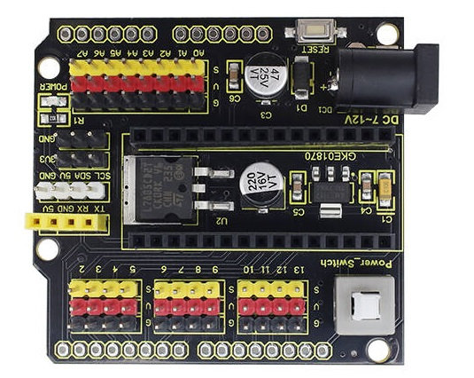
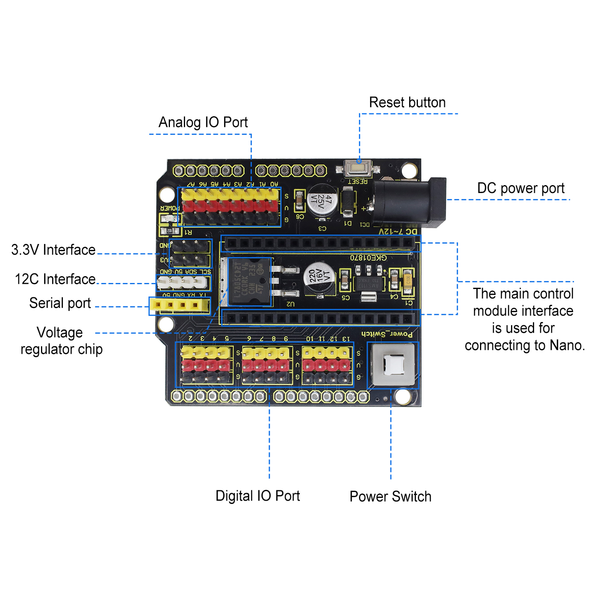
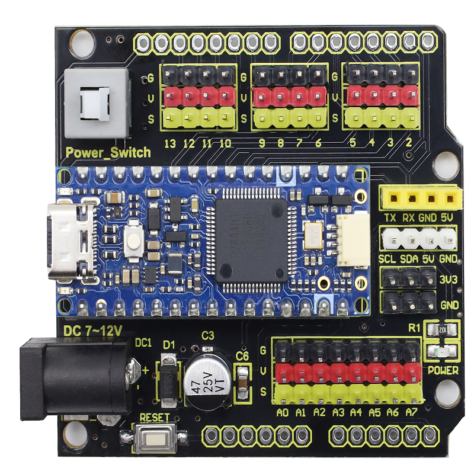
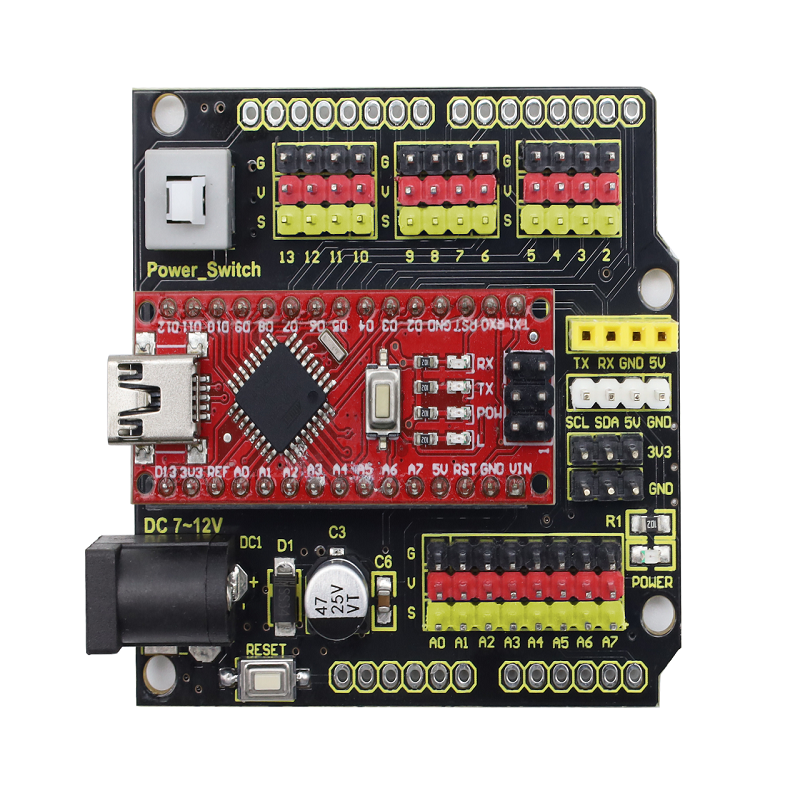

# KE0187 keyes NANO Expansion Board for Arduino Nano3.0/4.0

## 1.Introduction

This Arduino Nano expansion board is compatible with Arduino Nano 3.0 and Nano 4.0 and is suitable for embedded learning, prototype development and electronic project applications. It supports Windows(32-bit, 64-bit) and Linux systems, allowing you to get started quickly without an additional downloader. It also supports program burning through the ISP interface to meet diverse development needs. In addition, it provides abundant I/O resources and a stable power supply, including 12 digital I/O pins (6 of which support PWM output), 3-pin digital and analog interfaces (G-GND V-5V S-digital/analog port). And it can, on the one hand, power the NANO control board; On the other hand, it also stably outputs 5V (output current 1.5A) for external sensors/modules through the voltage stabilizing chip LM7805. Moreover, 5V can also be converted to 3.3V by the AMS1117 chip and led out by pins. Finally, it is also equipped with a reset button and a signal indicator. The two rows of 2.54mm pad holes reserved on its side lead out all the external interfaces of the NANO board.

## 2.Parameters

- Supports ISP port burning programs
- Operating voltage: 5V
- External input voltage: DC 7-12V
- Current: The on-board 5V voltage regulator chip L7805 can output a current of 1.5A
- Maximum power: 7W
- Digital I/O pins: 12 (6 of which can provide PWM output)
- Analog input pins: 8
- Operating temperature: -20 ° C to 60 ° C
- Pin header spacing: 2.54mm
- Fixing hole diameters: 3mm
- Dimensions: 57.3* 53.5MM
- Environment protection attribute: ROHS

## 3.Pin-out

## 4.Connection

When inserting the USB interface of the Arduino Nano 4.0 development board, the direction should be consistent with the that of the power switch, as shown above.

When inserting the USB interface of the Arduino Nano 3.0 development board, the direction should be consistent with the that of the power switch, as shown above.
